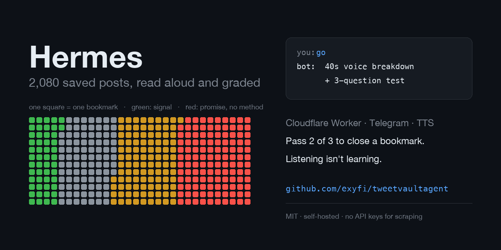

# tweetvault



A Telegram bot that reads your saved posts out loud, one at a time, and refuses to
mark one as done until you pass a test on it.

Built after a Twitter bookmark folder hit 2,080 posts across two years, none of them
reopened. Digests didn't fix it: a digest adds one more stream you don't read. What
shrinks a pile is a decision per item, and a decision needs proof you understood it.

Runs on a Cloudflare Worker. Your laptop harvests once, then stays out of the loop.

## What it does

- **Voice breakdowns.** Text `go`, get a 40-second episode: what the author claims,
  what the claim rests on, what to do about it tonight. Full article text, not the preview.
- **Comprehension tests.** Longreads ship with three questions, pass 2 of 3 to close the
  item. Fail and you retake with different questions. Short notes get a one-tap close instead.
- **Goal lanes.** Every item is tagged with which of your goals it serves. `/money`,
  `/skill`, `/self` pull from one lane; the default rotation keeps every lane moving.
- **Noise axis.** A second tag scores whether a post contains a checkable artifact (code,
  a measured number, first-person experience with failures) or a promise with no method.
  Promise-heavy longreads land in their own lane, where the breakdown explains the
  technique used on you instead of repeating the claims.
- **Any URL.** Send a link to an article and it joins the same pipeline.
- **Web panel.** `/panel` renders the whole queue with per-item state and a button that
  queues an episode.

## Architecture

```
your Chrome ──► post IDs (DOM only)      one-time harvest, local
      │
      ▼
public tweet API ──► full text, articles, threads
      │
      ▼
annotate in batches ──► goal + noise + priority + one action
      │
      ▼
POST /import, /annotate, /queue
      │
      ▼
Cloudflare Worker ──► KV + Queues ──► Telegram
                                        ▲
                          crons, buttons, tests, panel
```

The split matters: scraping needs your logged-in browser, everything after that needs
to survive a closed laptop.

## Three things that cost me hours

1. **X ignores programmatic scrolling.** `window.scrollTo` moves the page, but the
   virtualized list doesn't re-render and no new posts load. Only real wheel events
   advance the feed. End of feed = spinner gone AND count unchanged for five cycles;
   anything less and you stop early believing you got everything.
2. **An X Article renders as an empty post with an image.** 41 of the first 170 items
   in my export were longreads I nearly discarded as junk, including the three best
   texts in the pile. Always check `tweet.article.content.blocks[]`, `is_note_tweet`,
   and `quote` before judging a post by its preview.
3. **`ctx.waitUntil` dies about 30 seconds after the response.** The breakdown pipeline
   takes 40 to 90. Background jobs were being killed with no exception thrown, so the
   user saw a "generating..." placeholder and then silence. Every long job moved to
   Cloudflare Queues, which allow 15 minutes.

## Setup

Needs a Cloudflare account (Workers Paid, $5/mo, for the queue and write limits), a
Telegram bot token, an OpenAI key, and optionally an ElevenLabs key for better voice.

```bash
git clone https://github.com/exyfi/tweetvaultagent && cd tweetvaultagent/worker
cp wrangler.example.toml wrangler.toml     # fill in name, KV id, PUBLIC_URL, voice

npx wrangler kv namespace create VAULT     # put the id into wrangler.toml
npx wrangler queues create hermes-jobs

printf '%s' "$TELEGRAM_TOKEN" | npx wrangler secret put TELEGRAM_TOKEN
printf '%s' "$(openssl rand -hex 24)" | npx wrangler secret put WEBHOOK_SECRET
printf '%s' "$OPENAI_KEY" | npx wrangler secret put OPENAI_API_KEY
printf '%s' "$ELEVENLABS_KEY" | npx wrangler secret put ELEVENLABS_API_KEY   # optional

npx wrangler deploy
```

Point Telegram at the worker, then message the bot first (the first chat becomes the owner):

```bash
curl "https://api.telegram.org/bot$TELEGRAM_TOKEN/setWebhook" \
  --data-urlencode "url=https://<your-worker>/tg/<WEBHOOK_SECRET>" \
  --data-urlencode 'allowed_updates=["message","callback_query"]'
```

`allowed_updates` must include `callback_query` or every button silently does nothing.

Write your reader profile ([docs/PROFILE.example.md](docs/PROFILE.example.md)) and store it:

```bash
npx wrangler kv key put --binding VAULT --remote profile "$(cat docs/PROFILE.md)"
```

## Loading your bookmarks

1. Open your bookmarks page in your own browser, paste
   [scripts/harvest-bookmarks.js](scripts/harvest-bookmarks.js) into the console, scroll,
   call `__harvest()` as you go. It collects public post IDs from the DOM and reads no
   cookies, tokens, or session data.
2. `node scripts/enrich.mjs` pulls full content by ID from a public endpoint: articles,
   note tweets, quoted posts, thread parents.
3. Annotate in batches against the schema in
   [data/annotations.example.json](data/annotations.example.json). I ran this through
   parallel Claude Code agents, 35 items per batch.
4. `node scripts/build-queue.mjs annotations.json > queue.json`, then POST `/import`,
   `/annotate`, `/queue`.

## Annotation schema

| Field | Meaning |
|---|---|
| `g` | goal: `launch`, `niche`, `skill`, `self`, `news`, `none` |
| `n` | noise 0-3: signal / mixed / hook without method / repackaged filler |
| `p` | priority 1-5 |
| `s` | value 0-10 |
| `hook` | what's inside, in your language |
| `a` | one concrete action |
| `why` | why this score, one sentence |

Rename the goals to match yours; the code reads them from the queue.

## Commands

`go` · `/money` `/niche` `/skill` `/self` `/news` `/grift` · `/lanes` · `/stats` ·
`/panel` · `/digest` · `/weekly`. Send any link to file and review it on the spot.

## Cost

About 2 cents per episode on OpenAI, or an ElevenLabs Creator plan for around 65
episodes a month with a better voice. Cloudflare Workers Paid is $5/mo. The scraping
and content fetching cost nothing.

## License

MIT
